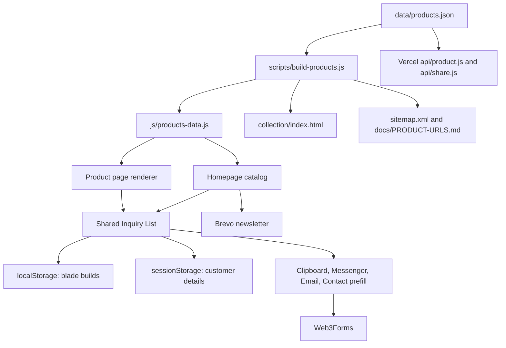
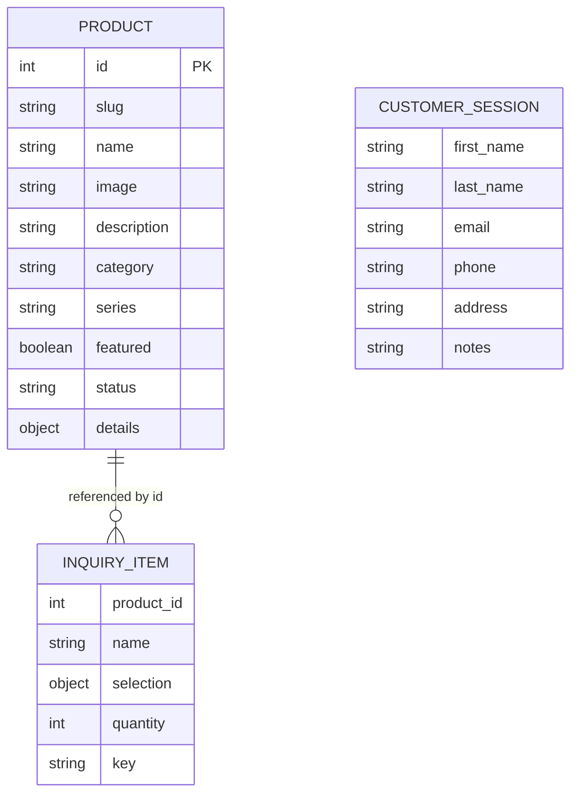

# Pangasinan Blades Web Application Documentation

Last reviewed: 2026-08-01

This document describes the implementation currently present in this repository. It does not describe an aspirational framework, database, admin panel, or order-processing backend.

## 1. Project Overview

### Project name

**Pangasinan Blades** (`pangasinan-blades`, version `1.0.0`)

### Purpose

The application is a public catalog and quotation-request website for Pangasinan Blades, a handcrafted Filipino blade business. It introduces the workshop and product series, lets visitors explore and configure products, and converts interest into a structured quotation request through the contact form, email, or Messenger.

### Target users

- Blade collectors and Filipino craft enthusiasts
- Customers requesting made-to-order or customized blades
- Customers checking possible ready-stock availability
- Domestic and international customers seeking quotations, shipping information, or after-sales support

### Core features

- Responsive homepage with hero slideshow, story, catalog, workshop, reviews, FAQ, policies, and contact sections
- Featured catalog and modal-based complete collection with filtering, search, and sorting
- Data-driven product pages at `/collection/?id={id}`
- Product specification configurator and image zoom
- Persistent Inquiry List and quote builder
- Duplicate detection, quantity management, editable specifications, and confirmation dialogs
- Customer details stored for the browser session
- Copy, Messenger, email, and Web3Forms quotation channels
- Product and collection sharing, QR codes, Open Graph previews, and social actions
- Workshop gallery/lightbox and testimonial carousel
- Brevo newsletter subscription
- Coming Soon and Maintenance modes
- Generated sitemap, product browser data, and product URL documentation

### Current development status

The application is functional and deployable as a Vercel-hosted static site with two Vercel serverless rendering endpoints. Automated build, asset, route, and inquiry-state validations exist and currently pass. The repository remains under active catalog and UX development. Product content verification, responsive image delivery, JavaScript modularization, and CSP cleanup remain open work.

## 2. Technology Stack

| Area | Actual implementation |
|---|---|
| Frontend framework | None; static HTML and vanilla JavaScript |
| Backend framework | None; two CommonJS Vercel serverless functions |
| Languages | HTML5, CSS3, JavaScript (CommonJS in build/API scripts and browser JavaScript in the UI), JSON, Markdown |
| UI library | None |
| Fonts | Google Fonts: Playfair Display, Cormorant Garamond, Inter |
| Data store | `data/products.json` plus browser `localStorage` and `sessionStorage` |
| Database / ORM | None |
| Authentication | None |
| Forms | Web3Forms contact submission; Brevo newsletter subscription |
| Sharing | Web Share API, Clipboard API, mailto links, social share URLs, vendored QRCode.js 1.0.0 |
| Analytics | Vercel Analytics browser script; package lock contains `@vercel/analytics` 2.0.1 |
| Hosting | Vercel, configured by `vercel.json` |
| Build runtime | Node.js 18 or newer |
| Tests | Node.js scripts using built-in `assert`; no external test framework |

No React, Angular, Vue, Tailwind CSS, PHP, SQL database, Firebase, or application server is present.

## 3. Repository Structure

```text
.
|-- api/
|   |-- product.js              # Server-rendered product metadata and HTML
|   `-- share.js                # Social crawler preview and redirect page
|-- assets/
|   |-- favicon_io/             # Favicons and web app manifest
|   `-- images/                 # Collection, hero, heritage, workshop, and OG media
|-- collection/
|   `-- index.html              # Generated shared product page
|-- config/
|   `-- site-status.js          # Coming Soon/Maintenance flags and page content
|-- data/
|   `-- products.json           # Canonical product source
|-- docs/                       # Audits, claims review, QA matrix, generated URLs
|-- js/
|   |-- inquiry-list.js         # Shared inquiry storage and quote formatting
|   |-- product-page.js         # Product-page rendering and interactions
|   |-- products-data.js        # Generated browser product array
|   |-- share.js                # Share modal and channel actions
|   |-- site-status-guard.js    # Global status routing decision
|   |-- site-status-page.js     # Status page renderer
|   `-- vendor/qrcode.min.js    # QRCode.js 1.0.0
|-- scripts/
|   |-- build-products.js       # Generates product artifacts
|   |-- validate-build.js       # Structural, asset, route, SEO, and config checks
|   `-- validate-inquiry-workflow.js
|-- templates/
|   `-- product.html            # Source template for collection/index.html
|-- index.html                  # Homepage and its dialog markup
|-- script.js                   # Homepage behavior
|-- style.css                   # Homepage/global styles
|-- product.css                 # Product-page styles
|-- site-status.css             # Coming Soon/Maintenance styles
|-- coming-soon.html
|-- maintenance.html
|-- package.json
|-- vercel.json
|-- sitemap.xml                 # Generated
`-- robots.txt
```

There are no application components, controllers, models, guards, or middleware in a framework-specific sense. The closest equivalents are browser modules under `js/`, serverless request handlers under `api/`, and the site status guard.

## 4. Application Architecture

The repository uses a static-first, data-driven architecture:

1. Developers maintain product records in `data/products.json`.
2. `scripts/build-products.js` validates basic product integrity and generates browser data, the shared product page, sitemap entries, and URL documentation.
3. The homepage renders product cards from `window.PANGASINAN_PRODUCTS`.
4. The product page reads `?id=`, finds the matching product, and renders content client-side.
5. On Vercel, `/collection/?id=` is rewritten to `api/product.js`, which injects product-specific metadata before returning the shared product HTML. Browser JavaScript then renders the visible page.
6. Inquiry items are persisted in `localStorage`; customer contact details are persisted only in `sessionStorage`.
7. Contact and newsletter submissions go directly from the browser to third-party services.



### State management

- `window.PANGASINAN_PRODUCTS`: generated, read-only browser catalog data.
- `pangasinanBladesInquiryList`: `localStorage` key used for inquiry items.
- `pangasinanBladesInquiryCustomer`: `sessionStorage` key used for name, email, phone, address, and notes.
- `pangasinanBladesContactPrefill`: temporary `sessionStorage` message used when moving from a product page to the homepage contact form.
- URL state: numeric product ID in the query string and `#full-collection` for the complete catalog modal.

### Dependency relationships

- `script.js` and `js/product-page.js` depend on `js/products-data.js` and `js/inquiry-list.js` being loaded first.
- `js/share.js` depends on product data and optionally `QRCode` from `js/vendor/qrcode.min.js`.
- Status pages depend on `config/site-status.js`, `js/site-status-guard.js`, and `js/site-status-page.js`.
- `api/product.js` reads generated `collection/index.html`; a production deployment must run the build first.

## 5. Installation and Setup

### Requirements

- Node.js 18 or newer
- npm
- A browser
- Vercel only when testing production rewrites/serverless functions

### Install

```bash
npm install
```

### Generate application artifacts

```bash
npm run build
```

### Validate

```bash
npm run validate
npm run validate:inquiry
```

No project-specific development-server command is defined in `package.json`. Opening `index.html` directly supports many local flows, including product links that switch to `collection/index.html?id={id}` under `file://`. Production rewrite behavior requires Vercel or an equivalent environment that implements `vercel.json`.

There is no database setup, migration, or seed command.

## 6. Environment Variables

The repository defines and reads **no environment variables**.

| Variable | Required | Purpose | Example | Used by |
|---|---|---|---|---|
| None | N/A | No `process.env` or browser environment-variable lookup is implemented | N/A | N/A |

Public form configuration is currently hardcoded in `index.html`. Actual values are intentionally not repeated here. If moved to deployment configuration later, remember that browser-delivered form identifiers are still public; provider-side domain restrictions and abuse controls remain necessary.

## 7. Database Documentation

There is no database, schema, SQL file, migration, ORM, table, foreign key, index, or cascade rule.

Product data is a JSON array in `data/products.json`. Browser inquiry state is client-owned storage and is not synchronized to a server.



The diagram describes client data relationships, not persisted SQL entities.

## 8. API Documentation

### `GET /collection/?id={id}`

- **Handler:** `api/product.js` through Vercel rewrites
- **Purpose:** Return the shared product page with server-rendered title, description, canonical URL, Open Graph/Twitter metadata, and Product JSON-LD.
- **Authentication:** None
- **Query parameter:** `id`, required positive numeric product ID
- **Request body:** None
- **Success:** `200 text/html`; cacheable for one hour with stale revalidation
- **Error:** `404 text/plain` with `Product not found.`

Example:

```http
GET /collection/?id=1
```

### `GET /share/?id={id}&v={version}`

- **Handler:** `api/share.js` through Vercel rewrites
- **Purpose:** Return crawler-readable social metadata, then redirect human browsers to the matching product page.
- **Authentication:** None
- **Query parameters:** `id` required; `v` optional cache-busting token restricted to letters, numbers, dots, underscores, and hyphens
- **Request body:** None
- **Success:** `200 text/html`; social metadata plus `window.location.replace()`
- **Unknown ID:** `302` redirect to `/#full-collection`

### External browser submissions

These are integrations, not repository-owned backend endpoints:

| Method | Destination | Purpose | Response expectation |
|---|---|---|---|
| POST | Web3Forms submission endpoint | Contact/quote form | JSON with `success: true` |
| POST | Brevo hosted form endpoint | Newsletter subscription | JSON with `success: true` |

## 9. Frontend Routes and Pages

| Route | File/handler | Purpose | Parameters/guard |
|---|---|---|---|
| `/` or `/index.html` | `index.html` | Main public experience | Site status guard |
| `/#catalog` | `index.html` | Featured catalog section | Hash navigation |
| `/#full-collection` | `index.html` | Opens complete collection modal | Hash/history behavior in `script.js` |
| `/#contact` | `index.html` | Contact and quote request form | May consume session prefill |
| `/collection/?id={id}` | `api/product.js` + generated page | Dynamic product details | Numeric product ID; site status guard |
| `/collection/index.html?id={id}` | Generated static page | Local/direct-file product fallback | Numeric product ID |
| `/share/?id={id}&v=5` | `api/share.js` | Social preview route | Numeric ID and optional version |
| `/coming-soon.html` | `coming-soon.html` | Coming Soon status page | Global status config or `?preview=1` |
| `/maintenance.html` | `maintenance.html` | Maintenance status page | Maintenance has priority; `?preview=1` supported |

No lazy-loaded modules or authenticated routes exist.

## 10. Main Features

| Feature | Status | Implementation |
|---|---|---|
| Hero slideshow | Implemented | Ten configured slides, synchronized title/description, timed transitions, mobile styling |
| Featured catalog | Implemented | Products where `featured === true` |
| Complete collection | Implemented | Modal, category filters, live search, name/series sorting, direct product navigation |
| Product detail | Implemented | Dynamic ID lookup, metadata, related products, configurator, quantity, zoom |
| Availability status | Implemented with process limitation | `made-to-order` or `ready-stock`; ready stock uses cautious confirmation wording |
| Inquiry List | Implemented | Add, edit, remove, clear, count, quantity, duplicate merge, persistence |
| Quote formatting | Implemented | Shared product links, specs, customer details, requested outcomes, notes |
| Contact form | Implemented | Native validation plus custom minimum message validation and AJAX Web3Forms submission |
| Messenger/email | Implemented | Device-aware Messenger destination and generated mailto body |
| Sharing | Implemented | Native share, copy, QR, Facebook, Messenger, WhatsApp, X, Telegram, LinkedIn, email |
| Gallery/lightbox | Implemented | Workshop images, filters, keyboard activation, previous/next navigation |
| Testimonials | Implemented | Carousel and linked Facebook Reviews source |
| Newsletter | Implemented | Brevo AJAX submission and email validation |
| Site status modes | Implemented | Centralized flags with maintenance precedence and production-only option |
| Payments/order checkout | Not implemented | Website requests quotations; it does not process purchases or payments |
| Accounts/admin/order tracking | Not implemented | No authentication or server-side data storage |

## 11. Product Data Structure

`data/products.json` is the only manually maintained product source. It currently contains 44 records across Itak, Bolo, Moro, Combat, Outdoor, International, and Kitchen series.

```json
{
  "id": 1,
  "slug": "itak-tagalog",
  "image": "assets/images/collection/itak_series/itak_tagalog.webp",
  "name": "Itak Tagalog",
  "description": "Product-specific summary",
  "category": "itak",
  "series": "Itak Series",
  "featured": true,
  "status": "ready-stock",
  "details": {
    "bladeLength": "19 in",
    "steel": "5160 Carbon Steel",
    "handle": "Kamagong",
    "sheath": "Mahogany",
    "hardness": "57-60 HRC"
  }
}
```

| Field | Type | Rules/use |
|---|---|---|
| `id` | Integer | Positive and unique; public query-string identifier |
| `slug` | String | Required and unique; currently descriptive but not used as the route key |
| `image` | String | Required existing `.webp` path |
| `name` | String | Product display name |
| `description` | String | Card, product page, sharing, metadata, and structured-data description |
| `category` | String | `itak`, `bolo`, `moro`, `combat`, `outdoor`, `international`, or `kitchen` |
| `series` | String | Human-readable series label |
| `featured` | Boolean | Controls featured-catalog inclusion |
| `status` | String | `made-to-order` or `ready-stock` |
| `details.bladeLength` | String | Default editable blade length |
| `details.steel` | String | Default steel selection |
| `details.handle` | String | Default handle material |
| `details.sheath` | String | Default sheath/scabbard material |
| `details.hardness` | String | Default hardness display |

The UI also adds configurable `finish`, `intendedUse`, `customization`, and `quantity` values to an inquiry item. These are not currently part of the canonical product JSON defaults.

## 12. Components and Services

| File | Responsibility | Main inputs/outputs and side effects |
|---|---|---|
| `index.html` | Homepage structure and all homepage dialogs/forms | Semantic sections, inline content, third-party form configuration |
| `script.js` | Homepage application controller | Renders catalogs/gallery; controls navigation, dialogs, forms, carousel, inquiry UI, and canvas effects |
| `js/inquiry-list.js` | Shared inquiry service | Loads/saves storage, creates duplicate keys, formats quotes and product URLs |
| `js/product-page.js` | Product page controller | Reads query ID, renders product/meta/specs/related items, controls zoom and product inquiry dialogs |
| `js/share.js` | Share service/UI | Builds product/collection share data, controls modal/focus, clipboard, QR, and channel URLs |
| `config/site-status.js` | Status configuration | Flags, production hosts, branding, messages, images, contact/social links |
| `js/site-status-guard.js` | Global route guard | Resolves maintenance/coming-soon priority and redirects |
| `js/site-status-page.js` | Status page view renderer | Applies config to shared status markup |
| `api/product.js` | Product HTML metadata renderer | Reads `id`, product JSON, and generated template; returns HTML or 404 |
| `api/share.js` | Social preview renderer | Reads `id`, creates metadata, returns redirect page or collection redirect |
| `scripts/build-products.js` | Build generator | Reads JSON/template; writes browser data, product page, sitemap, URL docs |
| `scripts/validate-build.js` | Build verifier | Checks data, images, IDs, links, metadata, status routing, CSP compatibility, and HTTP files |
| `scripts/validate-inquiry-workflow.js` | Inquiry state test | Exercises storage, duplicate merging, quantity minimum, customer session, and quotation text |

## 13. Styling and Design System

### Global theme

`style.css` defines a black, charcoal, bone, silver, and gold visual system:

- `--obsidian: #080808`
- `--charcoal: #111111`
- `--steel: #1C1C1C`
- `--ash: #2E2E2E`
- `--silver: #888888`
- `--bone: #E2D9C8`
- `--gold: #C8963C`
- `--gold-light: #E0B060`
- `--white: #F0EBE0`

Display, accent, and body typography use Playfair Display, Cormorant Garamond, and Inter. Reusable classes include `.eyebrow`, `.section-title`, `.section-body`, `.btn-primary`, `.btn-ghost`, `.filter-pill`, `.reveal`, and dialog/card-specific utilities.

### Responsive behavior

- Main breakpoints: 1100px and 768px
- Additional feature breakpoints: 900px, 720px, 600px, 560px, and 480px
- Mobile navigation replaces desktop links
- Catalog grids collapse from multiple columns to one or two columns
- Product detail switches to a single-column layout
- Inquiry and confirmation dialogs constrain height and scroll internally
- Reduced-motion media queries disable or simplify animation where implemented

There is no external component library or CSS preprocessor.

## 14. Error Handling and Validation

### Contact form

- Required first name, last name, email, inquiry type, message, and privacy consent
- Native email validation
- Message length from 10 to 2000 characters with live counter
- Honeypot field
- Double-submission guard and disabled loading button
- JSON response validation (`success === true`)
- Accessible success/error status region
- Console logging for submit, success, and failure

### Newsletter

- Required email and native type-mismatch validation
- Loading state with 15-second reset fallback
- JSON response validation
- Dedicated success/error panels

### Inquiry workflow

- Invalid local/session JSON is caught and cleared
- Quantity is clamped to at least one
- Duplicate keys compare product/build specifications
- Confirmation dialogs cover duplicate, remove, and clear actions
- Quote actions are disabled while an item edit remains unsaved
- Empty, clipboard, popup, and channel-specific errors have user-facing messages

### Build/API errors

- Build fails on incomplete data, duplicate IDs/slugs, or missing images
- Extended validation checks categories, statuses, WebP use, internal assets, IDs, JSON-LD, sitemap, status routing, and direct static responses
- Unknown product API IDs return 404; unknown share IDs redirect to the collection

There is no global server exception middleware or remote error-monitoring service.

## 15. Security

### Confirmed controls

- HTML escaping is used in dynamic catalog, product, inquiry, API, and metadata output paths
- JSON-LD replacement prevents literal `<` injection in server-generated structured data
- Vercel sets CSP, `X-Content-Type-Options`, `X-Frame-Options`, Referrer Policy, and Permissions Policy
- External links generally use `noopener`/`noreferrer`
- Customer details use `sessionStorage`, while non-personal inquiry builds use `localStorage`
- No authentication credentials, payment data, or database secrets are handled

### Concerns

| Severity | File/area | Concern | Recommendation |
|---|---|---|---|
| High | `index.html` | Web3Forms identifier and Brevo hosted endpoint are browser-visible and can be abused if provider restrictions are weak | Restrict allowed domains, enable provider spam/rate controls, rotate identifiers if abused, and monitor usage |
| Medium | `vercel.json`, `index.html`, `script.js` | CSP permits `'unsafe-inline'`; homepage has 24 inline handlers and 23 inline style attributes | Move handlers/styles to modules and classes, then remove `'unsafe-inline'` |
| Medium | Third-party forms | Submission rate limiting is delegated entirely to Web3Forms/Brevo | Configure limits and spam protection in both dashboards |
| Medium | Dependencies | No automated dependency audit command or CI exists | Run `npm audit` during releases and add dependency update monitoring |
| Low | Client storage | Inquiry content remains on the device until cleared | Keep personal details session-only and document the persistence behavior |

No authorization layer is required for current read-only public endpoints. If write APIs, admin features, or order storage are added, authentication, authorization, CSRF strategy, server validation, audit logging, and rate limiting will be required.

## 16. Testing

No Jest, Vitest, Playwright, Cypress, or browser automation suite is configured.

Available checks:

```bash
npm run build
npm run validate
npm run validate:inquiry
```

- `validate-build.js` is an integration-style static/build validator and starts a temporary Node HTTP server for basic page responses.
- `validate-inquiry-workflow.js` is a unit-style state test using Node's built-in `assert` and in-memory storage.
- `docs/INQUIRY-QUOTATION-STATE-MATRIX.md` records owner-confirmed manual tests at 320, 360, 390, 768, 1024, and 1440 pixels and Brave desktop/mobile.

Highest-priority missing automated coverage:

1. Browser tests for modal focus, Escape handling, scrolling, and responsive layout
2. End-to-end quotation prefill/submission tests with mocked third-party responses
3. Catalog filter/search/sort and direct-hash tests
4. Product configurator, image zoom, sharing, and clipboard fallback tests
5. Accessibility scans and reduced-motion behavior

## 17. Build and Deployment

`npm run build` performs deterministic generation from `data/products.json` and `templates/product.html`:

- `js/products-data.js`
- `collection/index.html`
- `sitemap.xml`
- `docs/PRODUCT-URLS.md`

Vercel configuration:

- Framework: none
- Build command: `npm run build`
- Output directory: repository root (`.`)
- Clean URLs and trailing slashes enabled
- `/collection` and `/share` rewritten to Vercel functions
- Security headers applied globally
- Site status config served with `Cache-Control: no-store`

No Dockerfile, CI/CD workflow, GitHub Actions workflow, staging configuration, or deployment script is present. Deployment depends on Vercel interpreting `vercel.json`.

## 18. Known Issues and Technical Debt

| Severity | File/area | Issue | Recommended fix |
|---|---|---|---|
| High | `data/products.json`, `docs/CONTENT-CLAIMS-REVIEW.md` | Technical specs, hardness values, policies, and manufacturing/history claims still require owner verification | Complete business and technical approval before treating claims as guaranteed |
| High | Ready-stock records | No quantity, last-confirmed timestamp, expiry rule, or stock owner exists | Add an operational stock-verification process and data fields |
| Medium | `script.js` | 2,029-line multi-feature script has broad responsibilities | Split into navigation, catalog, inquiry, gallery, testimonials, and forms modules after regression tests exist |
| Medium | `js/product-page.js` and `script.js` | Inquiry rendering/dialog logic remains duplicated | Move rendering and dialog state into shared modules |
| Medium | `style.css` | 3,182-line stylesheet contains dense one-line media blocks and legacy feature rules | Organize by feature and remove selectors only after usage testing |
| Medium | Images | Responsive `srcset`/`sizes`, AVIF variants, and dedicated thumbnails are absent | Add generated responsive assets and defer full-resolution lightbox media |
| Medium | `script.js` gallery data | Some workshop cards still reference PNG/JPG originals despite WebP copies | Use optimized thumbnails and preserve originals for lightbox only |
| Medium | Category definitions | Categories are hardcoded in homepage and validator logic | Introduce shared category configuration or derive filter options from data |
| Medium | Product configurator | Finish/intended-use defaults and allowed options are global rather than product-specific | Add validated per-product customization metadata |
| Medium | Product IDs | Numeric IDs are public URLs and were recently reordered | Treat IDs as stable after publication or add permanent slug/canonical migration rules |
| Medium | Testing | No automated real-browser or accessibility suite | Add Playwright and accessibility checks |
| Low | Inline markup | 24 inline handlers and 23 inline styles block strict CSP | Move gradually into external JS/CSS |
| Low | Documentation | Older audits contain stale product counts and line references | Refresh or archive audits after this document is accepted |
| Low | Naming | Some historical labels use `Inquiry List` while user-facing workflow is a quote builder | Continue standardizing customer-facing terminology without changing storage compatibility |

## 19. Recommended Improvements

### High Priority

1. Verify every published product specification and business-policy claim.
2. Establish ready-stock confirmation fields and an operational update process.
3. Keep public product IDs stable and document URL migration rules before future reordering.
4. Restrict and monitor Web3Forms and Brevo integrations in their provider dashboards.
5. Add browser-level regression tests for the complete quotation journey.

### Medium Priority

1. Consolidate inquiry rendering and dialog logic.
2. Split `script.js` into focused browser modules.
3. Add product-specific customization choices and guidance.
4. Generate category filters from shared data.
5. Build responsive image variants and separate thumbnails from zoom/lightbox originals.
6. Add CI that runs build, validations, dependency audit, and browser tests.

### Low Priority

1. Remove inline handlers/styles and tighten CSP.
2. Add deliberate featured ranking.
3. Link hero slides and customer reviews to matching product pages.
4. Add a mobile-visible back-to-collection control on product pages.
5. Refresh older audit documents and stale line references.

## 20. Developer Onboarding Guide

1. Clone the repository.
2. Install Node.js 18 or newer.
3. Run `npm install`.
4. Do not configure a database; none exists.
5. Do not run migrations or seeds; none exist.
6. Review `config/site-status.js` and keep production flags false during normal development.
7. Run `npm run build`.
8. Run `npm run validate` and `npm run validate:inquiry`.
9. Open the static homepage for local UI work; use Vercel when testing serverless rewrites and crawler metadata.
10. Never edit generated `js/products-data.js`, `collection/index.html`, `sitemap.xml`, or `docs/PRODUCT-URLS.md` as the primary source.

## 21. Maintenance Guide

### Add or update a product

1. Add an optimized WebP under `assets/images/collection/{series}/`.
2. Add or edit the record in `data/products.json`.
3. Use a unique, stable positive `id` and unique `slug`.
4. Supply all required top-level and `details` fields.
5. Run all build and validation commands.
6. Check featured catalog, complete collection, product page, related products, sharing, and Inquiry List output.

### Add a category or series

Update product data, `FC_CATEGORIES` in `script.js`, and allowed categories in `scripts/validate-build.js`. Then add any required visual labels and test filters/search. This duplication is known technical debt.

### Add a frontend page

Create semantic HTML and dedicated styles/scripts as needed, include the site status guard if the page is public, add navigation and sitemap handling, and extend `validate-build.js` to check the page.

### Add an API endpoint

Create a CommonJS handler under `api/`, add a Vercel rewrite only if a custom public path is required, validate all input server-side, escape output, define caching/error behavior, and document it here.

### Add an environment variable

No environment abstraction currently exists. Read server-only values through `process.env` in Vercel functions and configure them in Vercel. Do not inject secrets into browser JavaScript or generated HTML.

### Add a database migration

Not applicable until a database technology and migration tool are deliberately introduced. Document the selected schema, ownership, backup, and deployment strategy before adding the first migration.

### Update images

Keep catalog references on WebP files. Preserve source PNG/JPG assets until visual comparison is complete. Maintain meaningful alt text, intrinsic dimensions, dark-background transparency, and zoom quality.

### Change availability

Set `status` to `made-to-order` or `ready-stock` in `data/products.json`, rebuild, and verify the wording. Do not mark ready stock without manual confirmation under the current business process.

### Mark a product as featured

Set `featured` to `true`, rebuild, and check the homepage count/order. There is no explicit featured rank; array/ID ordering affects presentation.

## 22. Documentation Accuracy Report

### Files and directories scanned

- All 182 non-`node_modules`, non-`.git` files were inventoried.
- Source/configuration reviewed: root HTML/CSS/JS/JSON/Markdown files, `api/`, `config/`, `data/`, `js/`, `scripts/`, `templates/`, and `docs/`.
- Asset directories were inventoried by path, extension, and product references. Binary image contents were not individually semantically classified in this documentation pass.
- Generated files were compared with their source/build scripts.

### Features confirmed from implementation

Catalog rendering, dynamic product routing, metadata rendering, sharing, QR generation, product configuration, inquiry persistence/editing, duplicate handling, quotation formatting, customer session storage, contact/newsletter AJAX submission, gallery/lightbox, testimonials, responsive navigation/dialogs, global status routing, build generation, and validation scripts.

### Features inferred but not confirmed

- Successful delivery of every Web3Forms email depends on provider configuration outside the repository.
- Successful Brevo subscription and list assignment depend on the hosted Brevo form configuration.
- Facebook/Messenger preview cache behavior depends on external platforms.
- Business claims and exact production specifications require owner approval.

### Missing or incomplete areas

- No database, accounts, admin area, checkout, order tracking, or payment processing
- No automated browser, accessibility, visual-regression, or third-party integration test suite
- No CI/CD workflow in the repository
- No responsive image pipeline
- No server-side customer or inquiry storage
- No environment-variable layer

### Assumptions made

- `https://www.pangasinanblades.com` is treated as the canonical production origin because all API, sitemap, QR, and metadata code uses it.
- Generated artifacts are expected to be committed because they are present in the repository and the build overwrites them.
- Product IDs should be treated as stable public identifiers even though the current validator only enforces uniqueness and positivity.

### Files that could not be analyzed

No text source/configuration file was inaccessible. `.git`, `node_modules`, and hidden tool-management directories were intentionally excluded from application analysis. Binary image pixels and external provider dashboards were outside the scope of repository-only verification.
